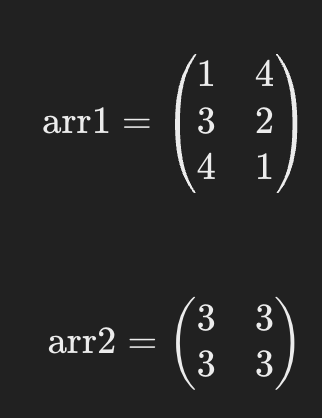
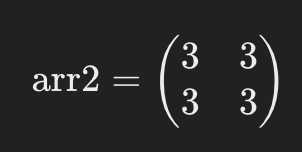
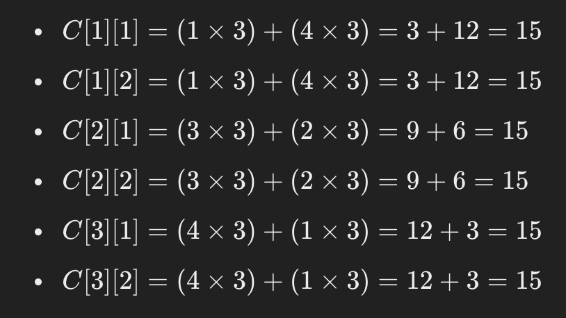

# 문제 설명

문제 설명
2차원 행렬 arr1과 arr2를 입력받아, arr1에 arr2를 곱한 결과를 반환하는 함수, solution을 완성해주세요.

제한 조건
행렬 arr1, arr2의 행과 열의 길이는 2 이상 100 이하입니다.
행렬 arr1, arr2의 원소는 -10 이상 20 이하인 자연수입니다.
곱할 수 있는 배열만 주어집니다.

입출력 예
arr1	
[[1, 4], [3, 2], [4, 1]]	
arr2	
[[3, 3], [3, 3]]	
return
[[15, 15], [15, 15], [15, 15]]







``` javascript
function solution(arr1, arr2) {
    let answer = [];
    for(let i=0;i<arr1.length;i++) {
        let multi = [];
        for(let j=0; j<arr2[0].length; j++) {
            let sum = 0;
            for(let k=0;k<arr1[i].length;k++) {
                sum += arr1[i][k] * arr2[k][j]
            }
            multi.push(sum);
        }
        answer.push(multi);
    }
    
    return answer;
}
```

다른사람의 풀이

```javascript
function productMatrix(A, B) {
    return A.map(function(row) {
        return row.map(function(_, i) {
            return row.reduce(function(sum, cell, j) {
                return sum + cell * B[j][i];
            }, 0);
        });
    });
}

```